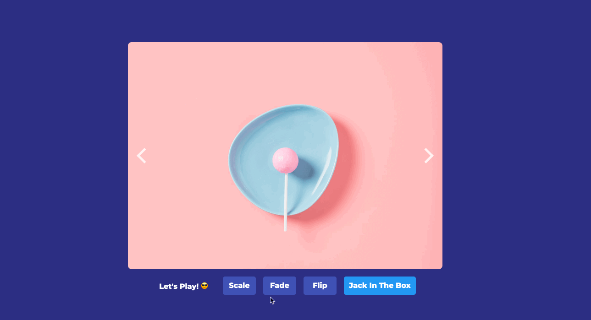

# AngularCarousel

### Features :sparkles:

:heart: **Created in Angular**: Angular V16

:zap: **Angular Animations**: Makes use of Angular animations

---

## Blog Post

[Lets create a carousel with reusable animations](https://medium.com/showpad-engineering/angular-animations-lets-create-a-carousel-with-reusable-animations-81c0dd8847e8)

## Demo

https://brampeirs.github.io/angular-carousel/

---

## node version

v18 (see .nvmrc file)

## Development server

Run `ng serve` for a dev server. Navigate to `http://localhost:4200/`. The app will automatically reload if you change any of the source files.

## Deploy to github pages

- install `npm install -g angular-cli-ghpages` see [cli-ghpages](https://medium.com/code-sketch/how-to-deploy-an-angular-7-app-to-github-pages-9427b609645f)
- Checkout gh-pages branch
- Pull master in it to have latest changes
- run `npm run build-and-deploy`
- visit https://brampeirs.github.io/angular-carousel/
